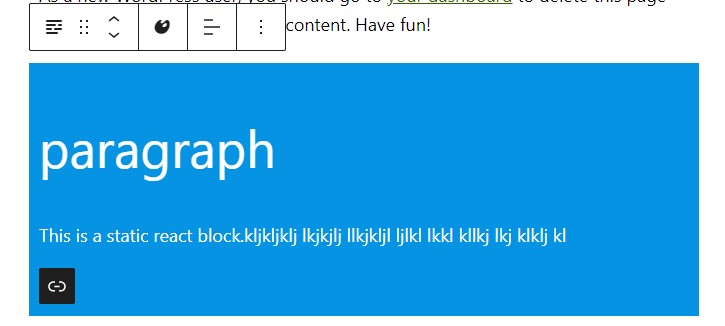
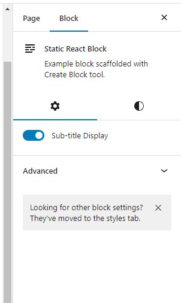
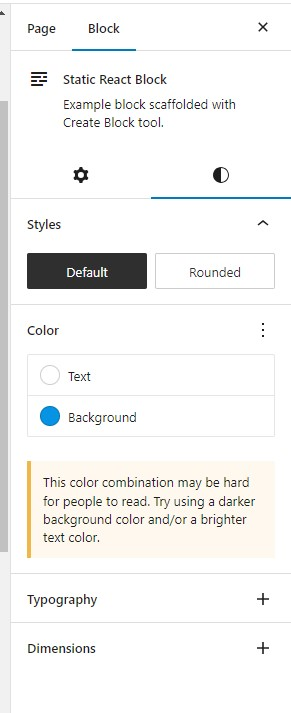

# Static_react_block
A gutenberg block for wordpress gutenberg block editor. This plugin allow user to register a block with texts (heading,description and link button). User will be able to manipulate alignment of the texts,conditionally display description field, colors of the block (background, text), spacing of the block (padding,margin) and shadow property of the block.  

## Project Display


\
\

\
\



## Built With

- VsCode
- React
- Wordpress block editor and components

# Getting Started

To get a local copy of the repository please run the following commands on your terminal:

```bash

$ git clone to plugin folders in wordpress site `https://github.com/ajkacca457/Static_react_block.git`
$ cd Static_react_block
$ Run `npm install` to install the necessary modules.
$ Run `npm run start` to start client server.

```

# Future development pipeline

To run test in your terminal:

- adding grid manipulation
- Adding transition animation dynamically
- custom font size selections
- custom font selection


# Authors

👤 **Avijit Karmaker**

- Github: [@Avijit](https://github.com/ajkacca457)
- Linkedin: [@Avijit](https://www.linkedin.com/in/avijit-karmaker-8738a54)

## 🤝 Contributing

Contributions, issues and feature requests are welcome!

## Show your support

Give a ⭐️ if you like this project!

## Copyright

This is a project developed by Avijit.
